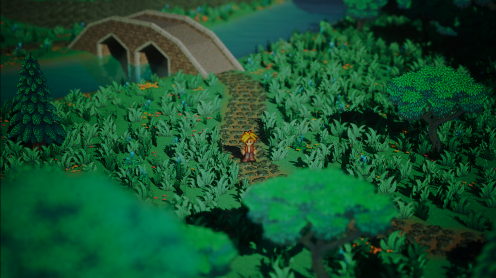

<div align="center">

# RPG-HD2D
**Un RPG en style HD-2D, projet de fin d'année de Pré-MSc à Epitech.**

🛠️ Développeurs gameplay : [Alexy](https://github.com/thedarkman195) - [Michel](https://github.com/MichelBKT)
<br>
👨‍💻 Développeurs IA : [Arthur](https://github.com/TeraLmec) - [Deyan](https://github.com/Deyanvkc)
<br>
🎮 Game Designer / Chef de projet : [Pol-Mattis](https://github.com/Oriloo)

[]()
</div>

## 📦 Installation

Requiert **Unreal Engine 5.6** et le plugin [**PaperZD**](https://www.fab.com/listings/6664e3b5-e376-47aa-a0dd-f7bbbd5b93c0) installé dans le moteur.

1. Cloner le projet
```bash
git clone https://github.com/Oriloo/RPG-HD2D.git
```

2. Ouvrir le fichier `RPG_HD2D.uproject`

3. Lancer le jeu en cliquant sur la flèche verte en haut au centre de la fenêtre d’Unreal Engine.
